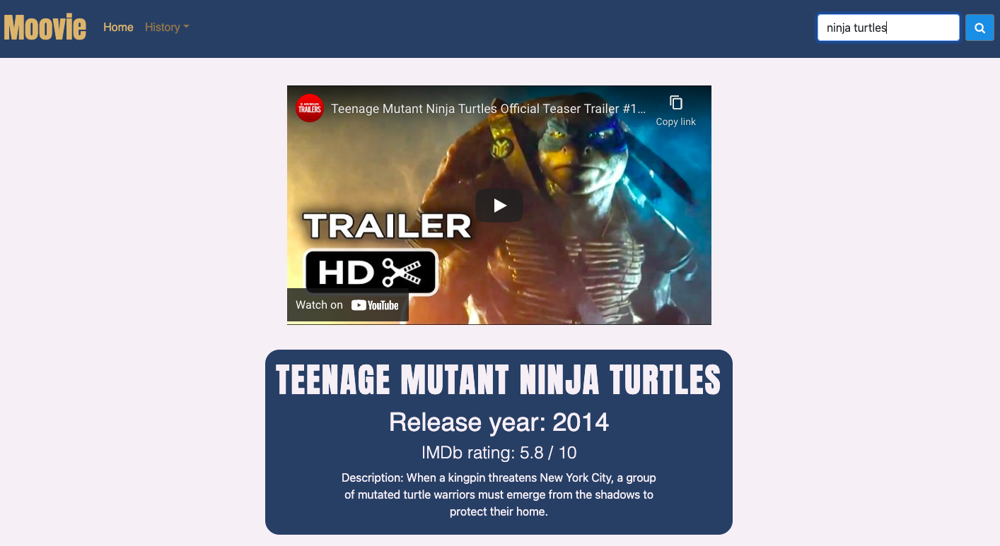

# Moovie Reviews

## Table of Contents

1. [Description](#description)
2. [Technologies Used](#technologies-used)
3. [Visuals](#visuals)
4. [Deployment](#deployment)

## Description

Moovie Reviews is a web application that allows the user to search for any movie and be presented wtih key details about that movie as well as an embedded video trailer from YouTube. The details provided include the title, release year, IMBd rating, and a short description. These details, along with the video trailer, will allow the user to better determine whether or not they would like to watch the movie.

## Technologies Used

- HTML, CSS, Javascript
- Bootstrap
- OMDb Movie Database API
- YouTube Data API
- YouTube Embed API

## Visuals

### Home Page:

### Results Page:

## Deployment

[-> Link to live site <-](https://slwooten.github.io/moovie-reviews/)